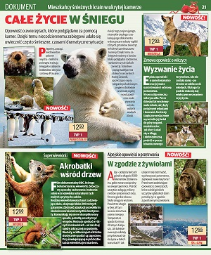
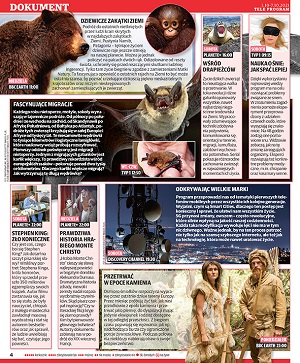

# My portfolio as a graphic designer and Front-End Developer

### live:

https://scorpion19702022.github.io/Graphic_designer_portfolio_live/

The project presents my portfolio summarizing many years of work as a computer graphic designer. It is also a presentation of my skills as a front-end programmer. In the project you can find links to some of my other programming projects.

---

### Graphics skills:

- InDesigh
- Photoshop
- Illustrator
- Acrobat

---

### Programmer skills:

- HTML5
- CSS/SASS/BEM
- JavaScript
- React.js

---

